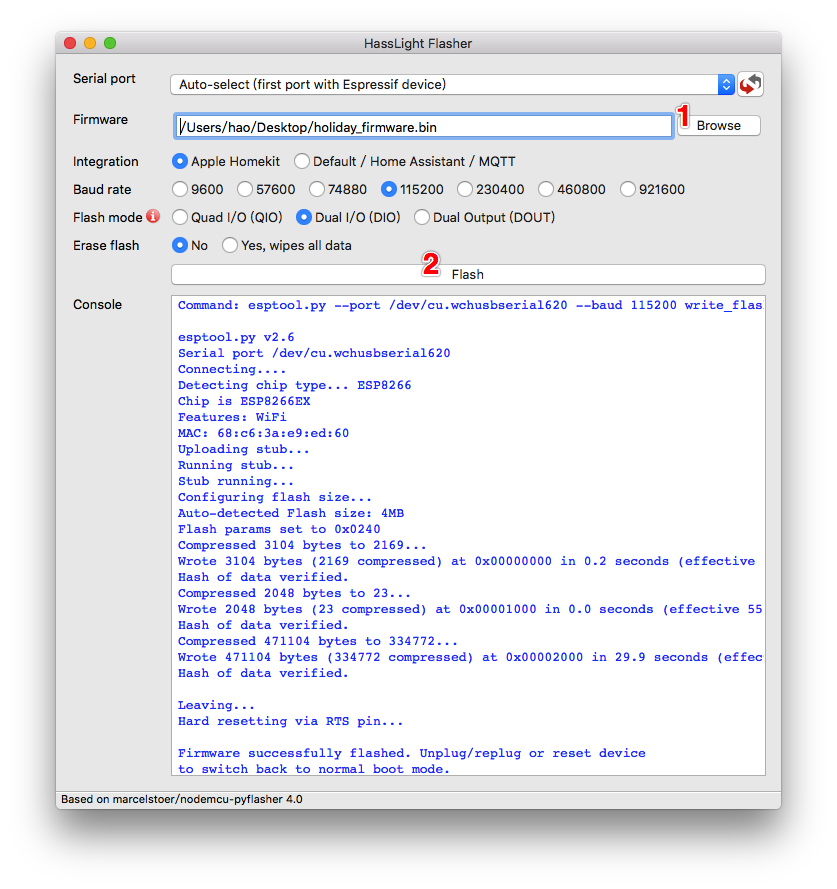
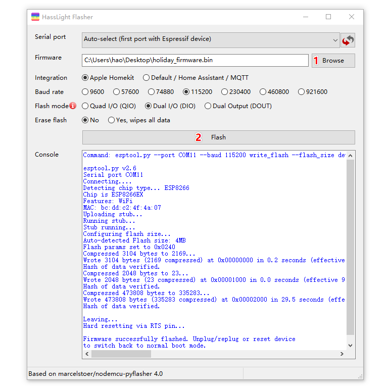
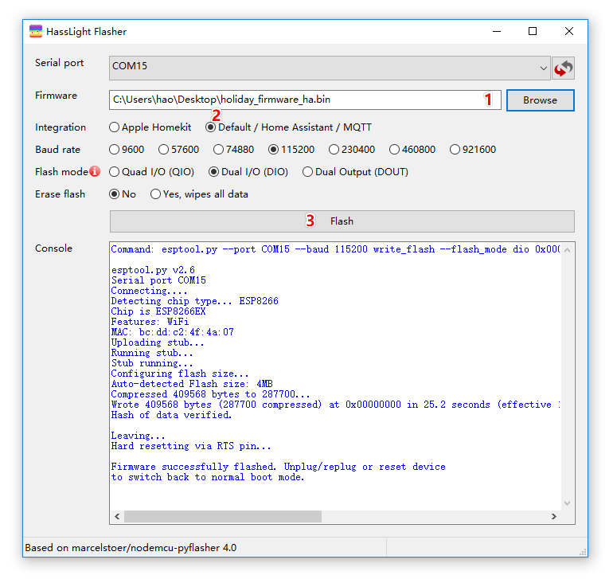

# Flash Firmware

The following guide helps you flash HassLight LED controller with Apple Homekit based firmware or Home Assistant MQTT based firmware.

> Please be aware that it's NOT necessary for you to flash the firmware. It comes with homekit based firmware by default.

Congratulations! If you are still reading this, I assume you are a professional and know what you are going to do. 
By using Home Assistant based firmware which usually means you want to have more flexibility in controlling your LED strip.

Have fun!

----

## Prerequesites 
1. Install [CH340G driver](https://sparks.gogo.co.nz/ch340.html) if you have never done this on your OS.
2. Download [HassLightFlasher.exe](https://github.com/hasslight/hasslightflasher/releases/download/v4.0-mod/HassLightFlasher-4.0-x64.exe) for Windows or [HassLightFlasher.dmg](https://github.com/hasslight/hasslightflasher/releases/download/v4.0-mod/HassLightFlasher-4.0.dmg) for Mac 
3. Choose the firmware to download  
3.1 For Apple Homekit  [holiday_firmware.bin](https://github.com/hasslight/hasslight.github.io/releases/download/v1.0/holiday_firmware_RGB.bin) or [mood_firmware.bin](https://github.com/hasslight/hasslight.github.io/releases/download/v1.0/mood_firmware_BRG.bin)  
3.2 For Home Assistant [holiday_firmware_ha.bin](https://github.com/hasslight/hasslight.github.io/releases/download/v1.0/holiday_firmware_RGB_ha.bin) or [mood_firmware_ha.bin](https://github.com/hasslight/hasslight.github.io/releases/download/v1.0/mood_firmware_BRG_ha.bin)  
3.3 *If you are using Linux*, you need 2 additional files [rboot.bin](https://github.com/hasslight/hasslight.github.io/releases/download/v1.0/rboot.bin) and [blank_config.bin](https://github.com/hasslight/hasslight.github.io/releases/download/v1.0/blank_config.bin)  

> When extending the LED strip longer, check this [Extend LED Strip](/extend)

## Apple Homekit

### Mac / Windows

* Start HassLightFlasher
   * Choose serial port, click refresh if not seen
   * Choose the firmware.bin which you just download 
   * Click "Flash" button, a successful flash looks like the example pictures below
* Next, follow the [User Maunal](guide) to config

### Linux

* Install esptool and then flash

    $ pip install esptool   
    $ esptool.py --chip esp8266 -p /dev/cu.wchusbserial620 --baud 115200 write_flash -fs detect -fm dio -ff 40m 0x0 rboot.bin 0x1000 blank_config.bin 0x2000 holiday_firmware.bin 

* Next, follow the [User Maunal](guide) to config
----

## Home Assistant
### Mac / Windows

* Start HassLightFlasher
   * Choose serial port, click refresh if not seen
   * Choose the firmware.bin which you just download 
   * Toggle "Default / Home Assistant / MQTT" integration
   * Click "Flash" button, a successful flash looks like the example pictures below
* Next, follow the [User Maunal](guide) to config

### Linux

* Install esptool and then flash

    $ pip install esptool   
    $ esptool.py --chip esp8266 -p /dev/cu.wchusbserial620 --baud 115200 write_flash -fs detect -fm dio -ff 40m 0x0 holiday_firmware.bin 

* Next, follow the [User Maunal](guide) to config