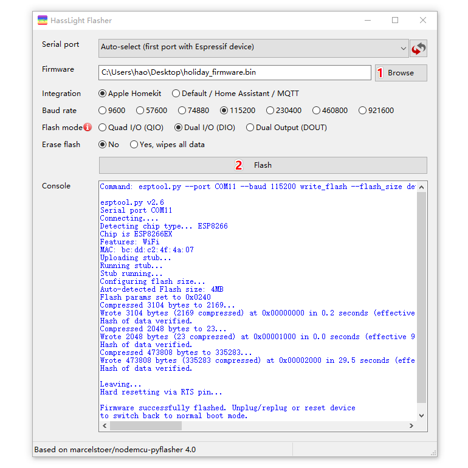
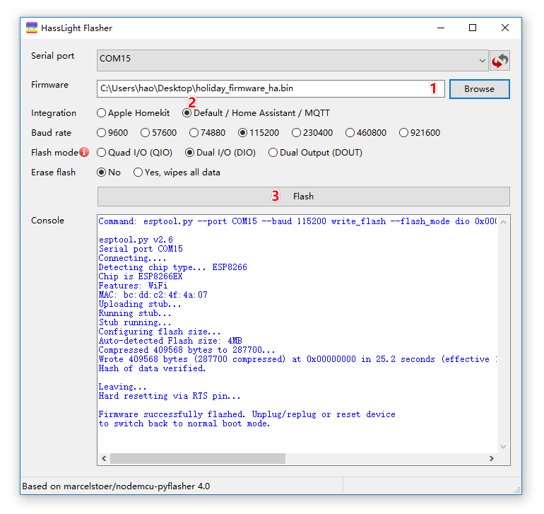

# 刷写固件

以下指南可帮助您使用基于Apple HomeKit的固件或基于Home Assistant MQTT的固件来刷写HassLight LED控制器。

>请注意，默认情况下，控制器带有基于HomeKit的固件，您无需刷写固件。 

恭喜你！ 如果您仍在阅读本文，我认为您是专业人士，并且知道您将要做什么。
通过使用基于HomeAssistant/WLED的固件，这通常意味着您希望在控制LED灯条方面具有更大的灵活性。

小心操作，玩得开心！

----

## 刷机准备 
1. 如果您的系统上尚未安装过 [CH340G 驱动](https://sparks.gogo.co.nz/ch340.html)， 请安装.
2. 下载刷机程序 
  
  Windows : [HassLightFlasher.exe](https://github.com/hasslight/hasslightflasher/releases/download/v4.0-mod/HassLightFlasher-4.0-x64.exe)  
  Mac : [HassLightFlasher.dmg](https://github.com/hasslight/hasslightflasher/releases/download/v4.0-mod/HassLightFlasher-4.0.dmg)

3. 选择对应的固件

集成方式     |   产品  | 颜色顺序     |  默认       | 长度    | 固件
--          | --      | --          | --          | --      | --  
Homekit | 节日彩灯串 (5V)  | RGB | 1 | 5-10 Meter | [下载](https://github.com/hasslight/hasslight.github.io/releases/download/v1.0/homekit_holiday_5V_100_RGB.bin) 
Homekit | 氛围灯带  (12V) | BRG | 1 | 5 Meter | [下载](https://github.com/hasslight/hasslight.github.io/releases/download/v1.0/homekit_mood_12V_300_BRG.bin) 
Homekit | 氛围灯带  (12V) | BRG | 0 | 10 Meter | [下载](https://github.com/hasslight/hasslight.github.io/releases/download/v1.0/homekit_mood_12V_600_BRG.bin) 
Homekit | 氛围灯带  (12V) | GRB | 0 | 5 Meter | [下载](https://github.com/hasslight/hasslight.github.io/releases/download/v1.0/homekit_mood_12V_300_GRB.bin) 
Homekit | 氛围灯带  (12V) | GRB | 0 | 10 Meter | [下载](https://github.com/hasslight/hasslight.github.io/releases/download/v1.0/homekit_mood_12V_600_GRB.bin) 
HomeAssistant | 节日彩灯串 (5V) | RGB | 0 | 5-10 Meter | [下载](https://github.com/hasslight/hasslight.github.io/releases/download/v1.0/ha_mqtt_holiday_5V_100_RGB.bin) 
HomeAssistant | 氛围灯带  (12V) | BRG | 0 | 5 Meter | [下载](https://github.com/hasslight/hasslight.github.io/releases/download/v1.0/ha_mqtt_mood_12V_300_BRG.bin) 
HomeAssistant | 氛围灯带  (12V) | GRB | 0 | 5 Meter | [下载](https://github.com/hasslight/hasslight.github.io/releases/download/v1.0/ha_mqtt_mood_12V_300_GRB.bin) 
WLED | 节日彩灯串 (5V)  | ANY | 0 | 5-10 Meter | [待上传]()
WLED | 氛围灯带  (12V) | ANY | 0 | 5-10 Meter | [待上传]()

 *如果您使用的是Linux命令*，则需要2个其他文件 [rboot.bin](https://github.com/hasslight/hasslight.github.io/releases/download/v1.0/rboot.bin) and [blank_config.bin](https://github.com/hasslight/hasslight.github.io/releases/download/v1.0/blank_config.bin)  

> 延长灯带默认长度请看 [Extend LED Strip](zh-cn/extend)

## Apple HomeKit

### Mac / Windows

* 打开控制器外壳，确认跳线帽的位置如图 **0-hkit**  
 

* 启动 HassLightFlasher
   * 选择 serial port, 默认是自动选择模式，您也可以选择确定的COM端口
   * 点击 Browse, 选择您刚才下载的固件 *.bin文件
   * 点击 "Flash" 按钮, 成功的日志输入类似下图
* 然后,  [使用 Apple Homekit](zh-cn/guide) 

### Linux

* Install esptool and then flash

    $ pip install esptool   
    $ esptool.py --chip esp8266 -p /dev/cu.wchusbserial620 --baud 115200 write_flash -fs detect -fm dio -ff 40m 0x0 rboot.bin 0x1000 blank_config.bin 0x2000 holiday_firmware.bin 

* Next, follow the [User Manual](zh-cn/guide) to config
----

## Home Assistant
### Mac / Windows

* 打开控制器外壳，确认跳线帽的位置如图 **0-hass**  
 

* 启动 HassLightFlasher
   * 选择 serial port, 默认是自动选择模式，您也可以选择某一个COM端口
   * 点击 Browse, 选择您刚才下载的固件 *.bin文件
   * 选中 "Default / Home Assistant / MQTT" 
   * 点击 "Flash" 按钮, 成功的日志输入类似下图
* 然后,  [使用 Home Assistant](zh-cn/guide-ha) 

### Linux

* Install esptool and then flash

    $ pip install esptool   
    $ esptool.py --chip esp8266 -p /dev/cu.wchusbserial620 --baud 115200 write_flash -fs detect -fm dio -ff 40m 0x0 holiday_firmware.bin 

* Next, follow the [User Manual](zh-cn/guide) to config